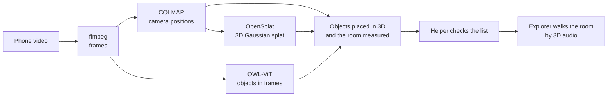

# Hearify

**Rehearse a place by sound.** A friend films a room once on a phone. Hearify turns the video into a 3D model, finds the
door, tables, chairs and stairs, and lets someone who can't see the room walk through it on headphones before they visit.

**[▶ Watch the demo on YouTube](https://youtu.be/IxJW1tRHwAg)**. Use headphones if you can: the sound is 3D.

| | |
|---|---|
| **What** | A hackathon project that joins 3D reconstruction, computer vision and spatial audio, for accessibility |
| **Built** | Solo, in over 190 commits |
| **Stack** | TypeScript, Next.js, React, three.js, Web Audio, Node.js, Docker, COLMAP, OpenSplat, OWL-ViT |
| **Tests** | 282 automated tests, all passing |
| **Runs on** | One laptop. No cloud and no paid services: every tool is free and open source |

*Formerly named Room Remix, which is why the repository is still called that.*

## How it's used

1. **Film.** A sighted helper films one slow lap of the room on a phone and imports the video.
2. **Check.** The laptop builds the 3D room and lists what it found. The helper renames, removes or adds objects, because
   a wrong label would mislead someone who can't see it.
3. **Explore.** The explorer puts on headphones and walks the room with the keyboard:
   - each object says its name from where it really is;
   - Space sweeps the room clockwise ("TV, table, door");
   - Tab picks a place, and Enter leads there with a pulse that speeds up as they get closer;
   - walking into something plays a thud and says what it was.

## What I built

- **A video-to-3D pipeline.** ffmpeg cuts the video into frames, COLMAP works out where the camera was for each one,
  and OpenSplat trains a 3D Gaussian splat on the GPU. Each step runs in its own Docker container.
- **Object finding in 3D.** OWL-ViT finds 16 kinds of object in 24 video frames. Each 2D box is then lifted into the
  room using the camera positions and the 3D points, and sightings of the same object from different frames are merged.
- **Room measuring.** The floor, walls and ceiling are fitted to the 3D points, and the scale comes from the height the
  phone was held at. This gives the room's size in metres and stops the explorer walking through walls.
- **3D audio in the browser.** Each sound is placed with the Web Audio API's head-related (HRTF) panning, so it comes
  from the right direction on headphones. The room's echo is computed from its size with the Eyring reverberation
  formula.
- **A build server.** A Node.js server takes the upload, queues the build, reports progress to the browser, and cleans
  up after a cancel or a crash.
- **Tests for the logic.** Walking, collisions, spoken directions, object placement and the server's API are covered by
  282 Vitest tests, with strict TypeScript and ESLint.

## Problems solved along the way

- **A quick build of a 43-second video went from 10 min 26 s to 4 min 41 s** when COLMAP's database was moved off the
  Windows folder mount and onto a Docker volume. The many small database writes were the slow part.
- **A classroom of identical chairs went from 2 of 199 frames placed to all 199.** COLMAP's first guess at the lens
  was far too narrow for phone video, so the guess was changed to match a phone's wide lens.
- **The Docker image build stopped freezing the laptop** once the number of parallel compile jobs was capped. The
  default used one per CPU core and ran Docker out of memory.

## Tech stack

| Area | Tools |
|---|---|
| Front end | Next.js 16, React 19, TypeScript, Tailwind CSS 4 |
| 3D view | three.js, Spark (Gaussian splat renderer) |
| Audio | Web Audio API, Kokoro (text-to-speech for the voice clips), the browser's speech synthesis for the narrator |
| Computer vision | COLMAP, OpenSplat (CUDA), OWL-ViT through transformers.js |
| Back end | Node.js HTTP server and job queue, Docker |
| Testing | Vitest, ESLint |

## How it was built

Each stage began as a written design and a step-by-step plan, then was built with Claude Code as a pair programmer.
The designs and plans are in [docs/superpowers](docs/superpowers), newest last. The most recent design is
[2026-10-08-hearify-sound-rehearsal-design.md](docs/superpowers/specs/2026-10-08-hearify-sound-rehearsal-design.md).

## Limits

- **It hasn't been tested with blind users yet.** That is the next step, so it makes no claim to help until it has.
- **It's for rehearsing before a visit, not for navigating on the day.** It doesn't replace a cane or a guide.
- **Distances are approximate.** The scale assumes the phone was held about 1.5 m above the floor.
- **Anything moved after filming is out of date,** such as chairs.

## Run it yourself

You need Node.js 22, Docker Desktop and an NVIDIA GPU. The pipeline image is built for RTX 40-series cards; for another
card, pass `--build-arg CMAKE_CUDA_ARCHITECTURES=<number>` to the build.

1. `npm install`
2. Start Docker Desktop.
3. `npm run pipeline:build` (first time only; roughly 30–60 minutes).
4. `npm run pipeline:check` (prints the GPU and each tool's version).
5. `npm run demo`, and allow Node through the firewall on private networks when asked.
6. Open `http://localhost:8080` on the laptop, or the printed `http://<laptop address>:8080` on a phone on the same
   Wi-Fi.

`npm test` runs the tests.

**If something goes wrong:**

- **The image build stalls, or Docker stops answering.** Rebuild with one compile job. It's slower, but it needs less
  memory: `docker build --build-arg BUILD_JOBS=1 -t hearify-splat pipeline`.
- **The phone can't reach the laptop.** On Windows, set the Wi-Fi network to Private. If the Wi-Fi keeps devices apart,
  turn on Mobile Hotspot on the laptop and connect the phone to it.

`npm run demo:serve` restarts the server without rebuilding the app. Each build's files (video, frames, COLMAP model,
splat, logs) are kept in `%LOCALAPPDATA%\Hearify\jobs`. Set `HEARIFY_JOBS_DIR` to change the folder, or `PORT` to change
the port.

